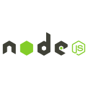

<h1 align="center">Hi There 👋, I'm Rajin Sandira</h1>
<h3 align="center">A Passionate Cyber Secuirty Student.</h3>

  

<h3 align="left">Connect with me:</h3>

<h3 align="left">Languages and Tools:</h3>

 
 
 
 
 
 

 
 
 
  

 

  
 
 
 
 
 
 
 
 
 
 
 
 

&nbsp;

